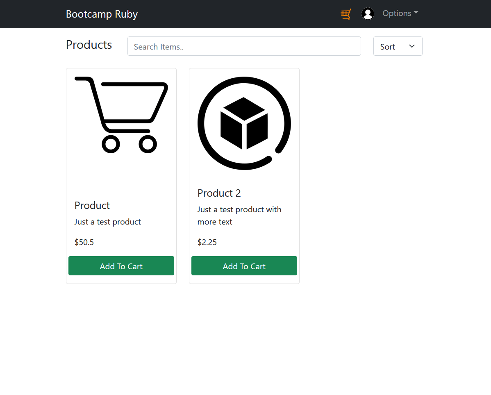

# Ruby on Rails Bootcamp Project
## E-Store App
Is a project with the things that I learned from the ruby on rails bootcamp, it includes an Ruby on Rails api, with a Postgresql database, and the frontend is built with React js, the api is using encrypted password, jwt, and it uploads files to an s3 bucket with Active Storage

## Technologies Used
- Ruby on rails
- React js
- Docker
- Postgresql

## Live
- [App](http://ec2-54-241-136-139.us-west-1.compute.amazonaws.com:3050)
- [API](http://ec2-3-101-26-149.us-west-1.compute.amazonaws.com:3000)

## Ruby on Rails API
### enpoints example
``http://localhost:3000/api/v1/users``
#### Response
```json
[
	{
		"id": 1,
		"name": "Shubert",
		"last_name": "Alonzo",
		"email": "email4@test.com",
		"address1": "calle1",
		"address2": "res2",
		"image_url": "https://bootcamp-ruby-shubert.s3.us-west-1.amazonaws.com/default/profile.png"
	},
	{
		"id": 2,
		"name": "test",
		"last_name": "test",
		"email": "test@test.com",
		"address1": "test",
		"address2": "test",
		"image_url": "http://localhost:3000/rails/active_storage/blobs/redirect/eyJfcmFpbHMiOnsibWVzc2FnZSI6IkJBaHBCZz09IiwiZXhwIjpudWxsLCJwdXIiOiJibG9iX2lkIn19--16ea34fc8fa79285664edb7b61b5c145d47fb60d/12-120961_logo-ruby-on-rails-hd-png-download.png"
	}
]
```

## React App Screenshot 

## To run with docker
``docker compose up -d``